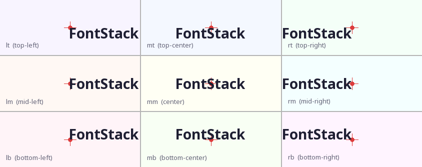

# Example 19 - Anchor points

Demonstrates all nine `anchor` values on `FontManager.draw()` in a 3×3 grid.
Every cell draws the same text aimed at the same reference point (the red
crosshair at the cell centre), but with a different anchor so you can see
exactly which corner, edge midpoint, or centre of the text block lands on
that coordinate.



## What it does

A 3×3 grid of cells is rendered, one per anchor value.  Each cell:

1. Draws a red crosshair at the exact centre of the cell (`CELL_W // 2, CELL_H // 2`).
2. Calls `manager.draw()` with `position=(cx, cy)` and the cell's `anchor` value.
3. Labels the anchor name in the bottom-left corner.

Because every draw uses the same `position` tuple but a different `anchor`,
the text block shifts so that the named point on the block coincides with the
crosshair.

## Anchor reference

```
lt ── mt ── rt
│           │
lm    mm    rm
│           │
lb ── mb ── rb
```

| Code | Horizontal | Vertical  |
|------|-----------|-----------|
| `lt` | left edge | top edge  |
| `mt` | centre    | top edge  |
| `rt` | right edge| top edge  |
| `lm` | left edge | midpoint  |
| `mm` | centre    | midpoint  |
| `rm` | right edge| midpoint  |
| `lb` | left edge | bottom    |
| `mb` | centre    | bottom    |
| `rb` | right edge| bottom    |

`"lt"` is the default and is backward-compatible with the historical behavior
where `position` always referred to the top-left corner of the text block.

## Parameters shown

| Parameter | Value | Purpose |
|-----------|-------|---------|
| `anchor`  | `"lt"` … `"rb"` | Controls which point of the block lands at `position` |
| `position` | `(cx, cy)` — cell centre | Shared reference point in every cell |
