# FontStack Examples

Each example is a standalone script that generates an `output.png`.

---

## Index

| # | Example | What it shows | Output |
|---|---------|---------------|--------|
| 01 | [Basic single-line rendering](01_basic/) | `draw_text()` with one font and padding | 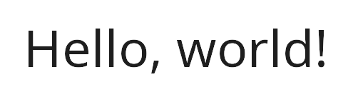 |
| 02 | [Variable font weight spectrum](02_weights/) | `weight=100` through `weight=900` from one font file | 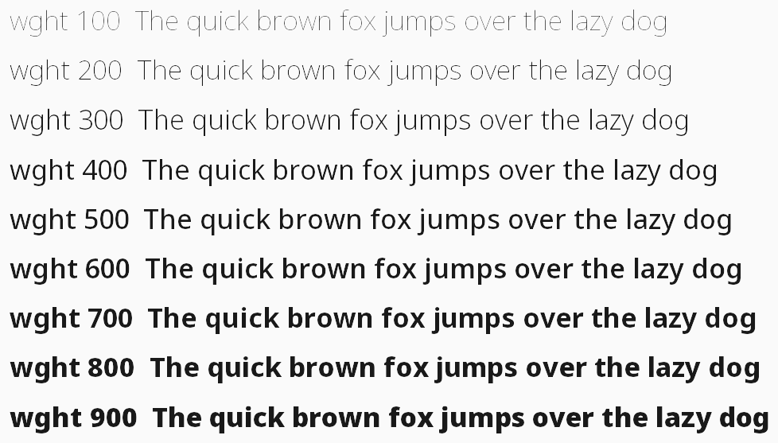 |
| 03 | [Word-wrap at a fixed max width](03_wrap/) | `mode="wrap"` and `line_spacing` | 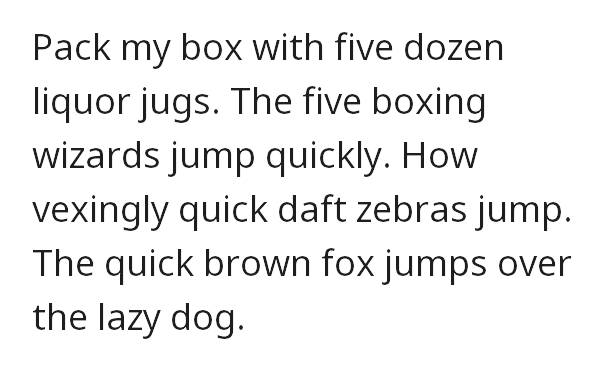 |
| 04 | [Scale to fit a fixed width](04_scale_to_fit/) | `mode="scale"` and `min_size` | 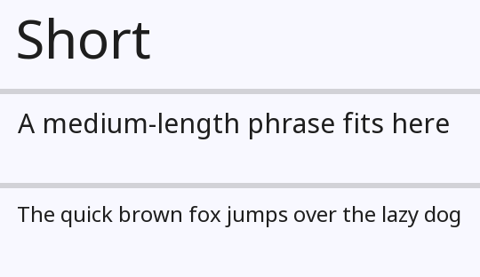 |
| 05 | [Horizontal alignment](05_alignment/) | `align="left"`, `"center"`, and `"right"` | 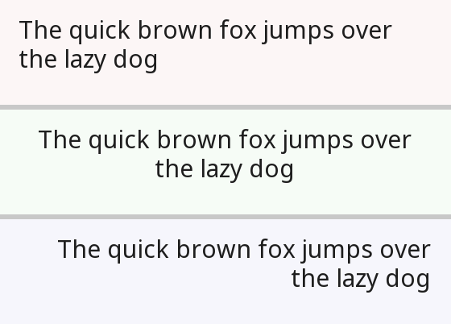 |
| 06 | [Arabic text](06_arabic/) | Automatic reshaping and BiDi reordering | 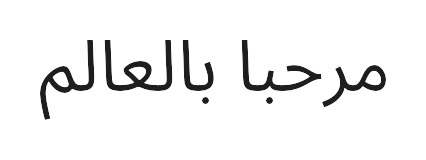 |
| 07 | [Mixed Latin and Arabic](07_mixed/) | Per-character font routing across scripts | 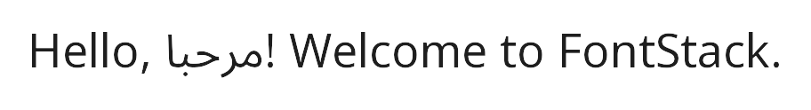 |
| 08 | [Inline emoji](08_emoji/) | Pilmoji / Twemoji with correct baseline alignment |  |
| 09 | [Chinese, Japanese, Korean](09_cjk/) | Four-font stack routing CJK characters | 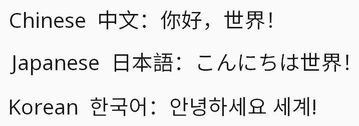 |
| 10 | [Devanagari, Hebrew, Bengali, Thai](10_scripts/) | Five-font stack across complex writing systems | 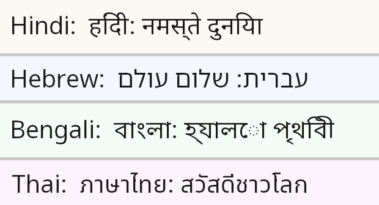 |
| 11 | [Nine scripts in one stack](11_multilingual/) | "Hello, World!" in nine languages from one `FontManager` | 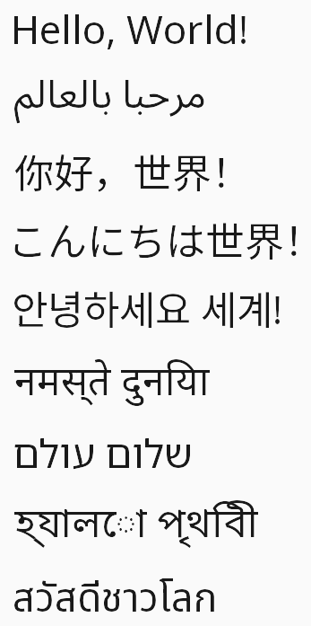 |
| 12 | [Unicode symbols and math](12_symbols/) | Arrows, chess pieces, math alphanumerics, fraktur | 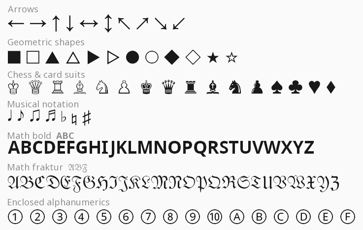 |
| 13 | [Fit mode: wrap, shrink, truncate](13_fit_mode/) | `mode="fit"` with `max_width`, `max_height`, and `min_size` | 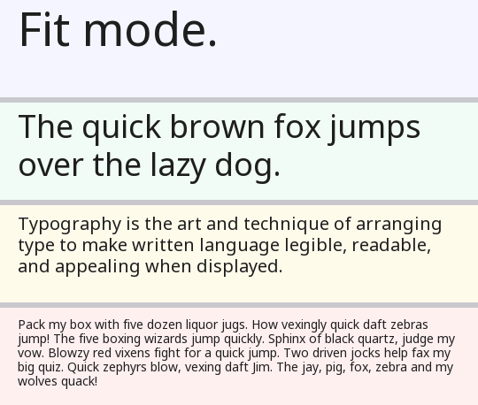 |

---

The fonts used by the examples are included in `tests/fonts/` in the repo.
